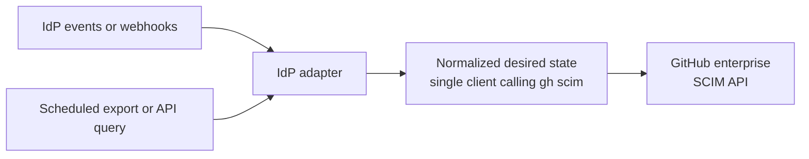

# gh-scim

A [`gh`](https://cli.github.com) CLI extension to (de)provision users and
groups on a GitHub Enterprise Managed Users (EMU) account using the
[SCIM REST API](https://docs.github.com/en/enterprise-cloud@latest/rest/enterprise-admin/scim),
for admins who are not using a
[paved-path identity provider](https://docs.github.com/en/enterprise-cloud@latest/admin/managing-iam/provisioning-user-accounts-with-scim/configuring-scim-provisioning-for-users#configuring-provisioning-for-other-identity-management-systems).

## Install

```sh
gh extension install eroullit/gh-scim
```

## Authentication

Requests are authenticated using `gh`'s normal token resolution (`gh auth
login`, `GH_TOKEN`, etc). Use a personal access token (classic) for the
enterprise setup user with only the `scim:enterprise` scope. Other identities
are typically created through SCIM itself.

Every command requires the enterprise slug, either via `--enterprise` or the
`GH_SCIM_ENTERPRISE` environment variable. For [enterprises on GHE.com](https://docs.github.com/en/enterprise-cloud@latest/admin/data-residency/about-github-enterprise-cloud-with-data-residency), set
`--hostname` (or `GH_HOST`) to `api.SUBDOMAIN.ghe.com`.

Only `list` and `get` commands are safe to run ad-hoc.
Store automation credentials in an approved secret manager and keep them out of
command arguments and logs. Define a tested rotation and recovery procedure.

## Production IdP integration

`gh scim` targets the enterprise SCIM API for Enterprise Managed Users, not
organization-level SCIM for personal accounts.
GitHub Enterprise Server setup is untested.

Before using it for automated provisioning:

1. [Create the enterprise with Enterprise Managed Users.](https://docs.github.com/en/enterprise-cloud@latest/admin/managing-iam/understanding-iam-for-enterprises/getting-started-with-enterprise-managed-users)
2. Configure and test SAML authentication. OIDC SSO is supported only with Microsoft Entra ID, and open SCIM configuration is unavailable when OIDC SSO is enabled.
3. [Enable open SCIM configuration.](https://docs.github.com/en/enterprise-cloud@latest/admin/managing-iam/provisioning-user-accounts-with-scim/configuring-scim-provisioning-for-users?versionId=enterprise-cloud%40latest&productId=admin&restPage=managing-iam%2Cunderstanding-iam-for-enterprises%2Cgetting-started-with-enterprise-managed-users#configuring-provisioning-for-other-identity-management-systems)

`gh scim` is a CLI tool that can be invoked manually by an administrator, but it makes the most sense to integrate it with the IdP.



## CLI Usage

### Users

```sh
# List provisioned users
gh scim users list
gh scim users list --filter 'userName eq "octocat"'

# Get a single user
gh scim users get <scim-user-id>

# Provision a new user
gh scim users create \
  --external-id E012345 \
  --username E012345 \
  --given-name Mona \
  --family-name Octocat \
  --display-name "Mona Lisa" \
  --email mlisa@example.com \
  --role user

# Replace all of a user's attributes (SCIM PUT)
gh scim users replace <scim-user-id> \
  --external-id E012345 --username E012345 \
  --display-name "Mona Lisa" --email mlisa@example.com

# Update a single attribute (SCIM PATCH)
gh scim users patch <scim-user-id> --path displayName --value "New Name"

# Soft-deprovision (suspend, reversible) / reactivate
gh scim users deprovision <scim-user-id>
gh scim users reactivate <scim-user-id>

# Hard-deprovision (irreversible)
gh scim users delete <scim-user-id> --confirm
```

### Groups

```sh
# List provisioned groups
gh scim groups list
gh scim groups list --excluded-attributes members

# Get a single group
gh scim groups get <scim-group-id>

# Provision a new group (members reference SCIM user ids)
gh scim groups create \
  --external-id 8aa1a0c0-c4c3-4bc0-b4a5-2ef676900159 \
  --display-name Engineering \
  --member <scim-user-id> --member <scim-user-id>

# Replace all of a group's attributes, including membership (SCIM PUT)
gh scim groups replace <scim-group-id> \
  --external-id 8aa1a0c0-c4c3-4bc0-b4a5-2ef676900159 \
  --display-name Engineering

# Update a single attribute (SCIM PATCH)
gh scim groups patch <scim-group-id> --path displayName --value Employees

# Manage membership without replacing the whole group
gh scim groups add-members <scim-group-id> <scim-user-id> [<scim-user-id> ...]
gh scim groups remove-members <scim-group-id> <scim-user-id> [<scim-user-id> ...]

# Delete a group
gh scim groups delete <scim-group-id> --confirm
```

All commands print the API's JSON response to stdout, making them easy to
pipe into `jq` or other tooling.

## Testing

Run the regular tests locally with:

```sh
go test ./...
```

The live end-to-end suite exercises user and group provisioning against
GitHub.com or GHE.com:

```sh
SCIM_TOKEN=... \
SCIM_ENTERPRISE=your-enterprise \
SCIM_TEST_EMAIL_DOMAIN=example.onmicrosoft.com \
go test -tags=e2e -count=1 -v ./test/e2e
```

The live suite enables verbose API tracing for each `gh-scim` invocation. With
`-v`, the test output includes the HTTP method, URL and query parameters,
sanitized headers, and JSON request body.

```sh
go build -o ./gh-scim .
SCIM_BINARY="$PWD/gh-scim" \
SCIM_TOKEN="$(gh auth token)" \
SCIM_ENTERPRISE="your-enterprise-slug" \
SCIM_TEST_EMAIL_DOMAIN="example.onmicrosoft.com" \
go test -tags=e2e -count=1 -v ./test/e2e
```

Set `SCIM_HOSTNAME` when testing a GHE.com Enterprise.

The live suite creates, updates, suspends, reactivates, and irreversibly deletes
a user. For groups, it creates, updates, modifies membership, and deletes the
group.

The `test` GitHub Actions workflow runs these tests regularly across the following environments:

| Environment | Target | Required configuration |
| --- | --- | --- |
| `dotcom` | GitHub.com | Environment secrets `SCIM_TOKEN`, `SCIM_ENTERPRISE`, and `SCIM_TEST_EMAIL_DOMAIN` |
| `ghecom` | GHE.com subdomain | The same three environment secrets, plus GitHub Actions environment variable `SCIM_HOSTNAME` set to the API hostname, such as `api.SUBDOMAIN.ghe.com` |

## Support

GitHub Support does not provide support for this integration.
This is a community-supported project 🚀

## Documentation

- [Go library](scim/example_test.go).
- [configuring SCIM provisioning](https://docs.github.com/en/enterprise-cloud@latest/admin/managing-iam/provisioning-user-accounts-with-scim/configuring-scim-provisioning-for-users).
- [using the enterprise SCIM REST API](https://docs.github.com/en/enterprise-cloud@latest/admin/managing-iam/provisioning-user-accounts-with-scim/provisioning-users-and-groups-with-scim-using-the-rest-api).
- [SAML and SCIM data mapping](https://docs.github.com/en/enterprise-cloud@latest/rest/enterprise-admin/scim#mapping-of-saml-and-scim-data).
- [deprovisioning and reinstating users](https://docs.github.com/en/enterprise-cloud@latest/admin/managing-iam/provisioning-user-accounts-with-scim/deprovisioning-and-reinstating-users).
- [managing team memberships with IdP groups](https://docs.github.com/en/enterprise-cloud@latest/admin/managing-iam/provisioning-user-accounts-with-scim/managing-team-memberships-with-identity-provider-groups).
- [best practices for SCIM provisioning](https://docs.github.com/en/enterprise-cloud@latest/admin/managing-iam/provisioning-user-accounts-with-scim/provisioning-users-and-groups-with-scim-using-the-rest-api#best-practices-for-scim-provisioning-with-githubs-rest-api).
- [SCIM troubleshooting tips](https://docs.github.com/en/enterprise-cloud@latest/admin/managing-iam/provisioning-user-accounts-with-scim/provisioning-users-and-groups-with-scim-using-the-rest-api#troubleshooting-scim-provisioning).
- [streaming the audit log for your enterprise](https://docs.github.com/en/enterprise-cloud@latest/admin/monitoring-activity-in-your-enterprise/reviewing-audit-logs-for-your-enterprise/streaming-the-audit-log-for-your-enterprise).